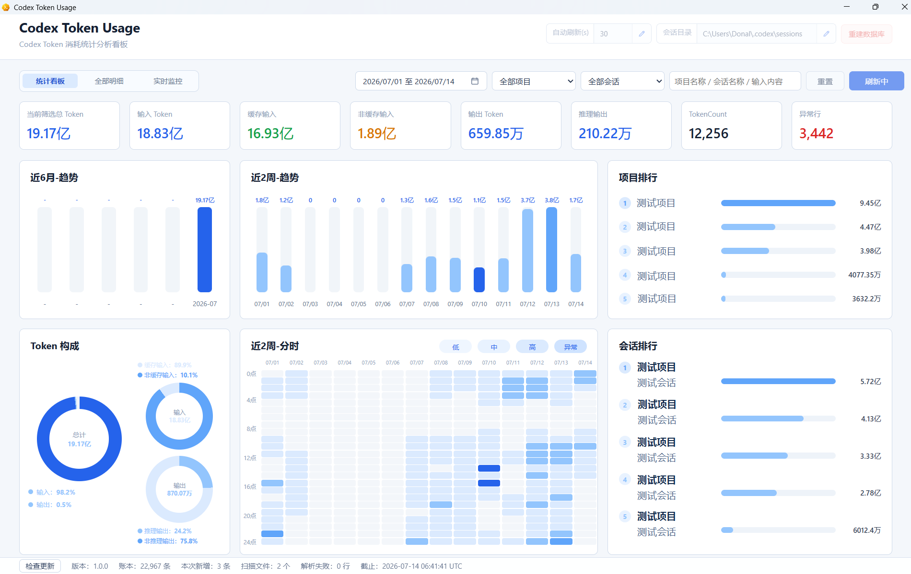

# Codex Token Usage

本机 Codex Token 消耗统计分析看板，帮助你查看 token 用量明细、趋势、项目与会话排行，以及本次启动后的实时变化。

## 用 Codex Skill 安装

在 Codex 中直接发送以下提示词：

```text
安装这个skill，下载软件
[DonaldL81/codex-token-usage](https://github.com/DonaldL81/codex-token-usage)
```

Skill 会读取 GitHub Latest Release，下载最新版 portable 包，并安装到稳定入口：

```text
%LOCALAPPDATA%\Programs\CodexTokenUsage\CodexTokenUsage.exe
```

## 界面预览



## 项目简介

Codex Token Usage 读取当前电脑可访问的 Codex 本地会话日志，建立本地 SQLite 账本，并提供可筛选的明细和统计看板。它用于理解本机 token 消耗的来源和趋势，不替代官方账单、官方额度或跨设备团队审计。

## 主要功能

1. **统计看板**：查看近6月-趋势、近 2 周趋势、近 2 周分时、Token 构成、项目排行和会话排行。
2. **全部明细**：按项目、会话、用户输入、轮次和 Token 记录查看分层数据，支持日期、项目、会话、关键词和异常筛选。
3. **实时监控**：仅展示本次软件启动后新增或变动会话中的用户输入。
4. **Token 归因线索**：在 Token 记录中查看前置动作摘要，帮助定位一次高消耗前发生了什么。
5. **导出明细**：导出当前筛选结果；默认只保留输入预览，不导出完整消息正文。
6. **本地维护**：可配置会话目录和刷新间隔，必要时安全重建本工具的本地数据库。
7. **桌面更新**：支持检查新版本；发现更新后可一键下载、替换稳定入口并重启。

## 使用方式

1. 启动工具后，默认按最近 14 天查询本机日志。
2. 在顶部选择日期范围、项目或会话；这些条件变更后会立即刷新数据。
3. 输入项目名称、会话名称或用户输入关键词后，点击右侧刷新按钮应用关键词筛选。
4. 在“统计看板”中查看趋势、分时分布和排行；在“全部明细”中展开层级并查看具体 token 字段。
5. 需要观察当前活动时，切换至“实时监控”。

## 数据与隐私

1. 工具只读取当前电脑上的 Codex 本地日志，不会读取其他电脑的数据。
2. 统计结果以本地日志为依据，可能与官方计费或额度口径不同。
3. 本地账本默认保存于 `%LOCALAPPDATA%\CodexTokenUsage\codex-token-usage.sqlite`。
4. 重建数据库只影响本工具的 SQLite 账本，不会删除 Codex 原始日志；执行前会自动备份当前账本。

## 常见问题

### 统计结果等于官方扣费吗？

不等于。它用于本机趋势分析和异常排查，不能替代官方账单或额度页面。

### 为什么会看到用户输入内容？

明细和实时监控需要展示输入预览，才能将 token 消耗与具体对话关联。导出默认不包含完整正文；公开分享报表前请自行确认内容范围。

### 检查更新失败会影响统计吗？

不会。更新检查失败不会影响日志读取、统计、筛选或导出。

## 1.0.1 更新内容

1. 软件首次成功启动时会自动创建或更新桌面快捷方式。
2. Skill 与安装说明统一为中文，默认完成下载、安装与启动。
3. 优化 README 中的 Skill 安装提示词。

## 1.0.0 更新内容

1. 发布首个正式稳定版，提供本机 Codex Token 消耗统计、全部明细和实时监控。
2. 完成项目、会话、用户输入、轮次与 Token 记录的分层查看，并支持本地筛选和明细导出。
3. 提供近 6 月、近 2 周和分时使用趋势，以及 Token 构成、项目排行和会话排行。
4. 提供稳定入口、托盘入口和 GitHub Release 一键更新流程。
5. 在底部状态栏显示当前应用版本，便于确认本机运行版本。
